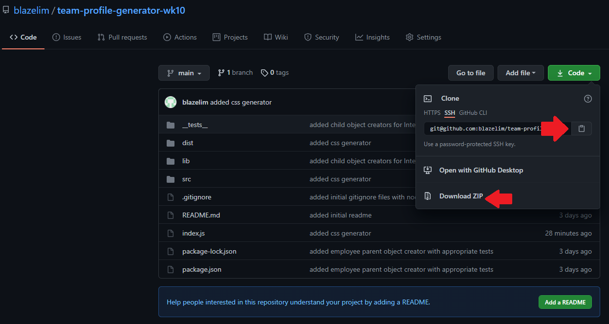

# Team Profile Generator

## Description
Welcome Team Managers! This is a project that is designed to help you manage your team. By using the node package, inquirer, information about your team can be gathered and placed nicely in a generated webpage. 

Additional features of the Team Profile generator include:
* an automatically generated link to your Engineers' github
* email links for all your employees that automatically opens your default email application
* Listing out additional information such as office number for managers and the school for the interns.

## Table of Contents
* [Video Walkthrough for Installation and Usage](#video-walkthrough-for-installation-and-usage)
* [Installation](#installation)
* [Usage](#usage)
* [Test](#test)
* [License](#license)
* [Questions](#questions)

## Video Walkthrough for Installation and Usage

## Installation

1. Download the project either by cloning it or by downloading the zip file (and unzipping as necessary)

2. In your command line interface (such as your terminal or commonly referred to as your CLI), navigate to root directory. Using 'ls' will let you know you are in the right place if you can see the names of the files in the picture above.

3. In your CLI, run 'npm install' to install the projects dependencies.

4. Your project is now ready to go.

## Usage

1. In your CLI in the root directory of the project, run 'node index.js'
2. Answer the prompts as they are given to you. (You may skip questions that are not required)
3. After all questions have been addressed, the generated README will be found in the 'dist' folder, which is located in the root directory.

## Test
There are 4 tests that test the class objects in this project. You can run them all simultaneously by running 'npm run test' in the CLI while in the root directory of the project. You may also run each test individually by running 'npm run test Intern', 'npm run test Engineer', 'npm run test Manager', or 'npm run test Employee' for each respective class object.

## License
This project is covered under the MIT license.
[Click here to see the terms of the license](https://choosealicense.com/licenses/mit/)

## Questions
Any questions or concerns?
Contact me on my github: [blazelim](https://github.com/blazelim/)

Or email me at: blazebentleycolim@gmail.com
